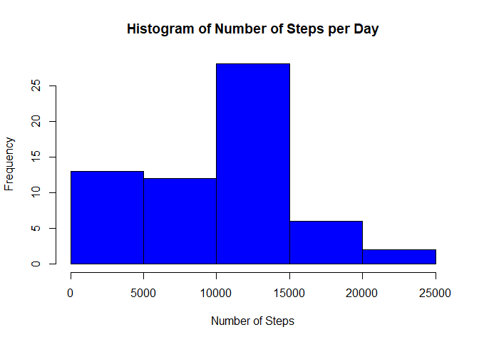
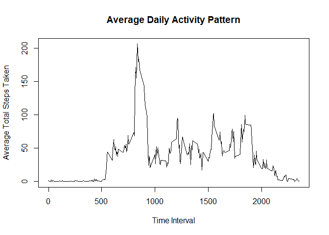
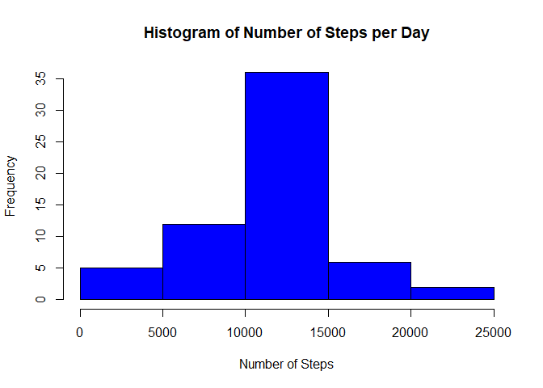
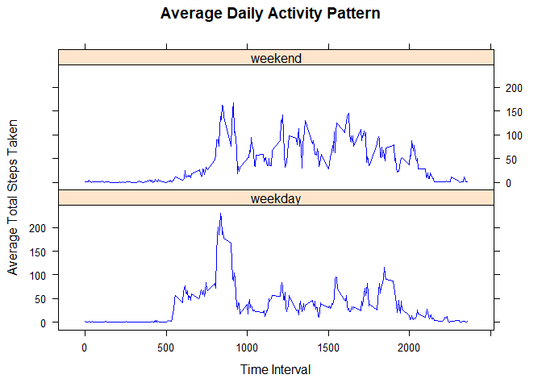

## R Markdown

In this assignment we were tasked with analyzing activity monitoring data from a personal activity monitoring device to look for activity patterns.  The data consists of 2 months of activity data which was recorded in 5 minute intervals through-out each day.  The data included in the dataset for this assignment are:  steps:  number of steps recorded in each 5 minute interval; date:  date the measurement was recorded; and interval:  numeric identifier for the 5 minute interval in which the measurement was taken.         

In the first task of the assignment we are working toward determining the mean total steps taken per day.  We will first load and process the data.  Processing consists of converting the character strings in the date column to dates.        


```r
library(lattice)
library(dplyr)
options(scipen=99999)
#load data
mydata<-read.csv("activity.csv",header=TRUE)
#preprocess data by converting character date to date
mydata$date<-as.Date(mydata$date,"%Y-%m-%d")
```

We will now calculate the total number of steps per day and plot that information out in the form of a histogram.


```r
#calculate total number of steps per day
totsteps<-tapply(mydata$steps,mydata$date,sum,na.rm=TRUE)
#produce histogram of steps per day
hist(totsteps,col="blue",main="Histogram of Number of Steps per Day",xlab="Number of Steps")
```

<!-- -->

We are then asked to report the mean and median of the total number of steps per day.


```r
#calculate and output mean and median of steps per day
msteps<-round(mean(totsteps),0)
print(paste("Mean =",msteps))
```

```
## [1] "Mean = 9354"
```

```r
medsteps<-round(median(totsteps),0)
print(paste("Median =",medsteps))
```

```
## [1] "Median = 10395"
```

We are now asked to determine the daily activity pattern.  This is completed by producing a time-series plot of the number of steps versus the 5-minute interval.


```r
#average across all days for each interval and then plot a time-series graph
meanint<-aggregate(steps~interval,data=mydata,mean,na.rm=TRUE)
plot(steps~interval,data=meanint,type="l",main="Average Daily Activity Pattern",xlab="Time Interval",ylab="Average Total Steps Taken")
```

<!-- -->

We are then asked to determine which 5-minute interval, on average across all days of the dataset, contains the greatest number of steps.


```r
#find time interval with highest average steps per day
maxint<-meanint[meanint$steps==max(meanint$steps),]$interval
print(paste("Time interval with highest number of steps =",maxint))
```

```
## [1] "Time interval with highest number of steps = 835"
```

Up until now the dataframe has contained a large number of missing values.  We are now tasked with imputing values into the cells containing NA so that we can analyze the resultant new dataframe and compare the results to those of the first.  We will first calculate the number of cells missing data.


```r
#find number of missing values
numna<-sum(is.na(mydata))
print(paste("Total instances of missing data =",numna))
```

```
## [1] "Total instances of missing data = 2304"
```

We are now to devise a strategy to fill in all missing data.  In this case we will be calculating the mean across each 5-minute interval and for a cell in that 5-minute interval that has missing data, we will fill that cell in with the mean of the interval.  We will perform this value replacement in a new dataframe so as to preserve the original dataframe.


```r
#create new dataframe and replace each missing value with the mean of the interval for that missing value
mydata2<-as.data.frame(mydata)
for(i in 1:nrow(mydata)){
     mydata2$interval[i]<-mydata$interval[i]
     if(is.na(mydata$steps[i])){
          intna<-mydata$interval[i]
          mydata2$steps[i]<-meanint[meanint$interval==intna,]$steps
     }
}
```

Lastly, we are asked to create a histogram of the total number of steps per day and to evaluate the new dataframe for the mean and median of the daily number of steps.  


```r
#produce histogram of new data
totsteps2<-tapply(mydata2$steps,mydata2$date,sum,na.rm=TRUE)
hist(totsteps2,col="blue",main="Histogram of Number of Steps per Day",xlab="Number of Steps")
```

<!-- -->

```r
#calculate mean and median of new data
msteps2<-round(mean(totsteps2),0)
print(paste("Mean =",msteps2))
```

```
## [1] "Mean = 10766"
```

```r
medsteps2<-round(median(totsteps2),0)
print(paste("Median =",medsteps2))
```

```
## [1] "Median = 10766"
```

We are now asked if the mean and median of the new dataset with imputed values in the missing cells differs from the mean and median of the original dataset.  In fact, they do as can be seen here:  mean of original dataset = 9354, median of original dataset = 10395; mean of new dataset = 10766, median of new dataset = 10766.  As can be seen, by imputing the mean of each interval into that interval's missing data cells, the mean and median now are equal to each other.

Lastly, we are asked to analyze the new dataset to determine if there are activity patterns that differ between weekdays and weekend days.  We will first add a column to our dataframe which contains a new factor variable identifying each date as either a "weekday" or a "weekend" day.


```r
#create a new variable to identify day of week for each date and classify as "weekday" or "weekend"
dayvec<-vector('character')
for (j in 1:nrow(mydata2)){
     if(weekdays(mydata2$date[j]) == "Saturday" | weekdays(mydata2$date[j]) == "Sunday"){
          dayvec[j]<-"weekend"
     }else dayvec[j]<-"weekday"
}
mydata2$wkday<-dayvec
```

We will now produce a panel plot to compare the average number of total steps taken in each 5-minute interval for each weekday with the average number of total steps taken in each 5-minute interval for each weekend day.


```r
#calculate average across "weekday" and "weekend" days
wkdays<-subset(mydata2,mydata2$wkday=="weekday")
wkends<-subset(mydata2,mydata2$wkday=="weekend")
meanwkdays<-aggregate(steps~interval,data=wkdays,mean,na.rm=TRUE)
meanwkends<-aggregate(steps~interval,data=wkends,mean,na.rm=TRUE)
#plot to a panel graph
vecwkday<-rep("weekday",nrow(meanwkdays))
meanwkdays$day<-vecwkday
vecwkend<-rep("weekend",nrow(meanwkends))
meanwkends$day<-vecwkend
mydata3<-rbind(meanwkdays,meanwkends)
xyplot(mydata3$steps~mydata3$interval|mydata3$day,data=mydata3,type="l",layout=c(1,2),main="Average Daily Activity Pattern",xlab="Time Interval",ylab="Average Total Steps Taken",col="blue")
```

<!-- -->
